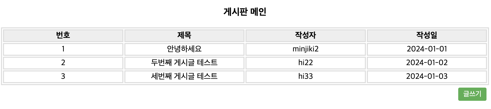

로그인,회원가입,세션,글쓰기 기능 게시판

**기간** 2023.12.23 ~

**기능**
1. 로그인과 회원가입 - mysql, JDBC driver
2. 세션관리 - HttpSession 객체
3. 게시판화면 - <table>

**예정기능**
1. 게시판 DB
2. 글쓰기 기능
3. 게시판 목록
4. 게시글 수정, 삭제 (필)
5. 댓글
6. 게시판 조회수
7. 게시판 검색 

**배운 점**
1. mysql, JDBC driver 활용
2. 세션과 쿠키의 개념, HttpSession객체를 통한 세션 관리

**느낀 점**
1. 언제나 더 좋은 코드가 떠오른다면, 그 이전의 코드는 버릴 것.
2. 코드는 간결하고, 가독성이 좋고, 유지보수가 쉽게끔 지속적인 변경을 할 것

