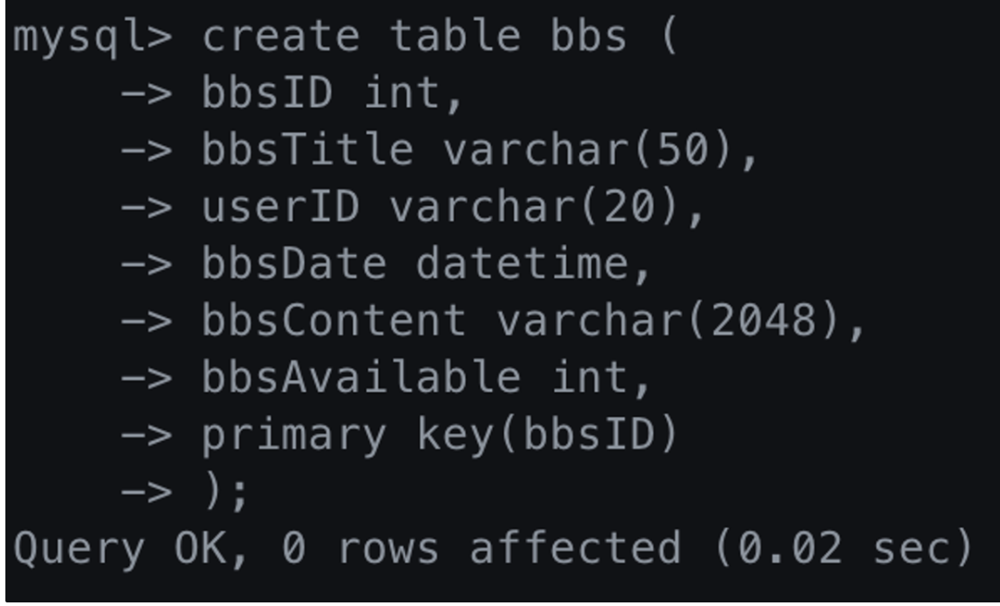
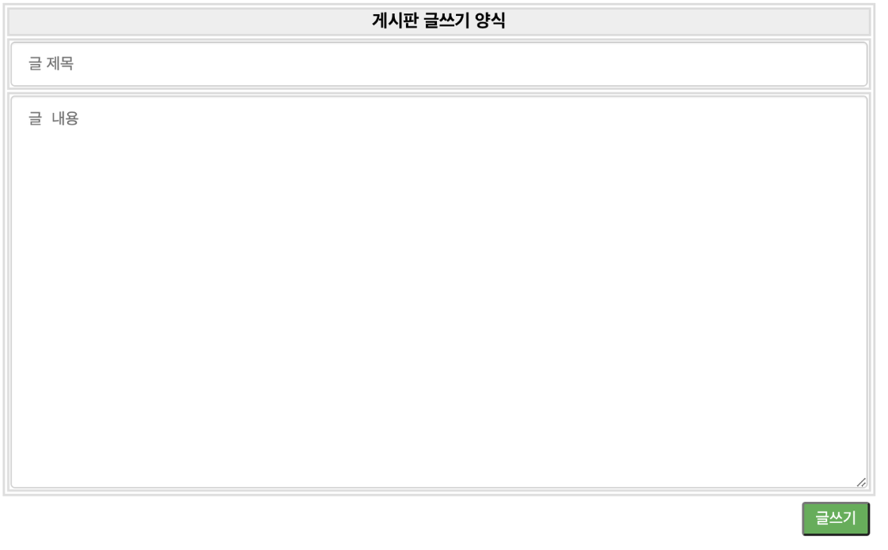
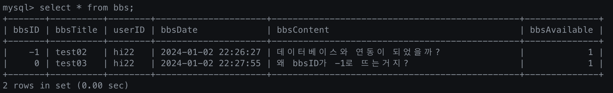

로그인,회원가입,세션,글쓰기 기능 게시판

**기간** 2023.12.23 ~

**기능**
1. 로그인과 회원가입 - mysql, JDBC driver
2. 세션관리 - HttpSession 객체
3. 게시판 메인화면 - table태그
4. 게시판 DB 구축 및 게시판 글쓰기 기능 - bbs table, insert문

**예정기능**
1. 게시판 DB
2. 글쓰기 기능
3. 게시판 목록
4. 게시글 수정, 삭제 (필)
5. 댓글
6. 게시판 조회수
7. 게시판 검색 

**배운 점**
1. mysql, JDBC driver 활용
2. 세션과 쿠키의 개념, HttpSession객체를 통한 세션 관리

**느낀 점**
1. 언제나 더 좋은 코드가 떠오른다면, 그 이전의 코드는 버릴 것.
2. 코드는 간결하고, 가독성이 좋고, 유지보수가 쉽게끔 지속적인 변경을 할 것

**로그인 화면**

**회원가입 회면**

**메인 화면**

**게시판 메인 화면**

**bbs 테이블**

**게시판 글쓰기 양식**

**게시판 글쓰기양식에서 쓴 내용이, mysql - bbs 테이블에 insert가 된 화면**

- bbsID가 -1이 아닌 0부터 올라간 이유
    - getNext() 메서드에서 return -1은 데이터베이스 오류일 때 나타난다. 그렇다면 -1을 반환하는 것은 일반적으로 "에러"나 "데이터없음"을 나타내는 관습적은 값이다. 즉, 게시글이 하나도 없을 때 -1을 반환하도록 하게 한 것이다.